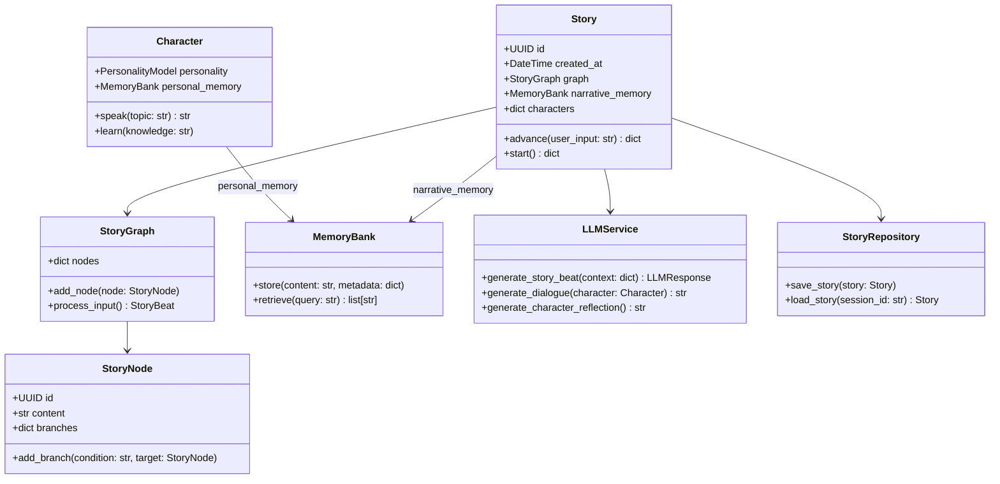
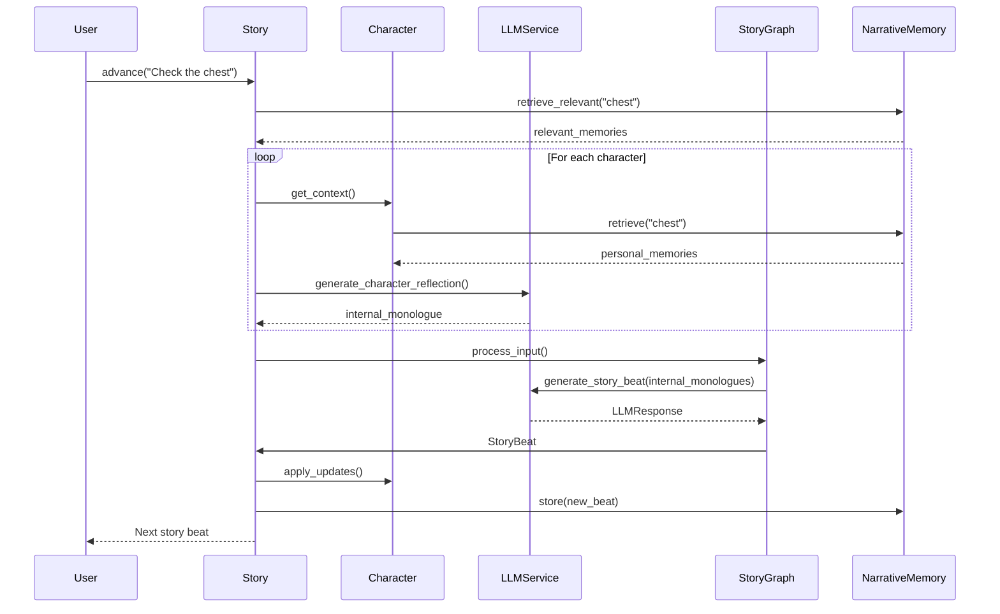

# Echo Forge AI

A flexible Python library for creating immersive, dynamic story-driven experiences with LLMs.

## Features

- Advanced narrative management with branching storylines
- Character personality and dialogue generation
- Embeddings-based memory system
- Plugin architecture for custom mechanics
- Multi-modal support (text, audio, images)
- Debug mode for development and troubleshooting

## Installation

Echo Forge AI uses [uv](https://github.com/astral-sh/uv) for package management. You can set up the project using our Makefile:

```bash
# Set up the environment and install dependencies
make setup
make install

# For development
make install-dev
```

Or manually:

```bash
pip install uv
uv venv
source .venv/bin/activate  # On Windows: .venv\Scripts\activate
uv pip install -r requirements.txt
```

## Quick Start

Run the tavern example using make:

```bash
# First, copy and configure your .env file
cd examples
cp .env.example .env
# Edit .env and add your OpenAI API key

# Then run the example
make run-tavern
```

## Debug Mode

Echo Forge AI includes a debug mode that provides detailed insights into the story generation process. Enable it to see:

- LLM API calls and responses
- Memory retrieval and storage operations
- Character state updates
- Story node progression
- And more

To enable debug mode in your code:

```python
from echoforgeai import Story, StoryConfig

story = Story(StoryConfig(
    title="My Story",
    api_key="your-api-key",
    debug_mode=True,  # Enable debug mode
    debug_level="DEBUG"  # Set logging level (DEBUG, INFO, WARNING, ERROR)
))
```

Or run the example with debug mode using make:

```bash
# Run with debug mode enabled
make run-tavern-debug

# Run with verbose debug output
make run-tavern-debug-verbose
```

## Development

Use make commands for development tasks:

```bash
# Format and lint code
make format
make lint

# Run tests
make test

# Clean up build artifacts
make clean

# See all available commands
make help
```

## License

MIT License - see LICENSE file for details.

## Architecture Overview

### Core Components



### Component Interactions



## Key Classes

### Story (echoforgeai/core/story.py)
The central controller managing narrative flow. Example usage:
```python
story = Story(config=StoryConfig(title="Dragon Quest"))
await story.add_character(Character("Gandalf", wizard_personality))
await story.start()

# Save state includes unique ID and timestamps
saved_state = story.save_state()
print(f"Saving story ID: {saved_state['story_id']}")
```

### StoryGraph (echoforgeai/graph/story_graph.py)
Manages branching narrative nodes and scene transitions:
```python
node = StoryNode(
    title="Dragon's Lair",
    content="You face a massive dragon...",
    branches={"attack": attack_node_id}
)
graph.add_node(node)
```

### Character (echoforgeai/core/character.py)
Represents NPCs/PCs with persistent memory and personality:
```python
merlin = Character(
    name="Merlin",
    personality=PersonalityModel(
        traits={"wise": 0.9, "secretive": 0.8},
        goals=[CharacterGoal("Protect the realm", priority=0.95)]
    )
)
```

### MemoryBank (echoforgeai/memory/vector_store.py)
Differentiated memory storage:
```python
# Story-wide narrative memory
story.narrative_memory.store("Dragon's hoard discovered", metadata={"chapter": 3})

# Character personal memory 
gandalf.personal_memory.store("The chest radiates ancient magic", metadata={"secret": True})

# Retrieve from appropriate context
story_memories = story.narrative_memory.retrieve("dragon treasure")
char_memories = gandalf.personal_memory.retrieve("ancient magic")
```

### StoryRepository (echoforgeai/persistence/story_repository.py)
Persists game states to SQL database:
```python
repo = StoryRepository()
await repo.save_story(current_story)  # Auto-saves characters, graph, and memories
```

### LLMService (echoforgeai/core/llm_service.py)
Now handles both narrative generation and character reasoning:
```python
class LLMService:
    async def generate_story_beat(...)  # Now accepts internal_monologues
    async def generate_character_reflection(...)  # New method
    
class LLMResponse:
    internal_monologues: Dict[str, str]  # Stores character thoughts
```

### Story (echoforgeai/core/story.py)
Handles character reflection loop:
```python
class Story:
    async def advance(self, user_input: str) -> dict:
        # New reflection loop
        for name, char in self.characters.items():
            internal_monologues[name] = await self.llm.generate_character_reflection(...)
        
        # Updated story beat generation
        llm_response = await self.llm.generate_story_beat(..., internal_monologues)
```

### Example Debug Output
Added character thought visualization:
```plaintext
[DEBUG] 2024-03-20 14:35:22 - echoforgeai.llm - Geralt internal monologue: 
"The griffin's wounds make it desperate - I should warn Ciri to keep her distance. But will she listen?"

[DEBUG] 2024-03-20 14:35:23 - echoforgeai.llm - Yennefer internal monologue: 
"These ruins radiate chaos energy... perfect for a trap, but is now the right time to reveal my plan?"

[DEBUG] 2024-03-20 14:35:25 - echoforgeai.story - Generated story beat incorporated:
- Geralt warns Ciri about the injured griffin
- Yennefer subtly examines the ancient ruins
- Player given choice to attack or use signs