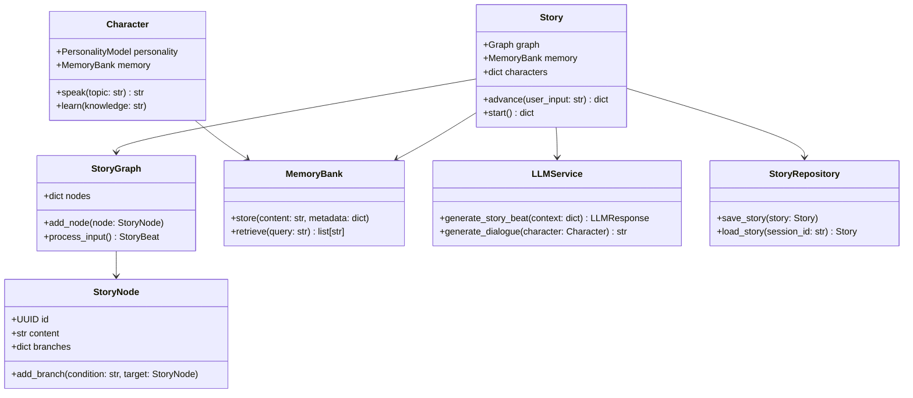
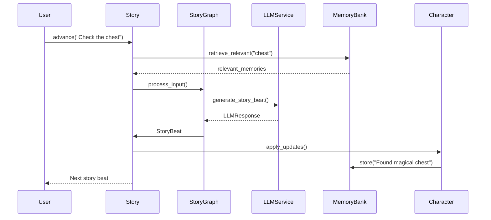

# Echo Forge AI

A flexible Python library for creating immersive, dynamic story-driven experiences with LLMs.

## Features

- Advanced narrative management with branching storylines
- Character personality and dialogue generation
- Embeddings-based memory system
- Plugin architecture for custom mechanics
- Multi-modal support (text, audio, images)
- Debug mode for development and troubleshooting

## Installation

Echo Forge AI uses [uv](https://github.com/astral-sh/uv) for package management. You can set up the project using our Makefile:

```bash
# Set up the environment and install dependencies
make setup
make install

# For development
make install-dev
```

Or manually:

```bash
pip install uv
uv venv
source .venv/bin/activate  # On Windows: .venv\Scripts\activate
uv pip install -r requirements.txt
```

## Quick Start

Run the tavern example using make:

```bash
# First, copy and configure your .env file
cd examples
cp .env.example .env
# Edit .env and add your OpenAI API key

# Then run the example
make run-tavern
```

## Debug Mode

Echo Forge AI includes a debug mode that provides detailed insights into the story generation process. Enable it to see:

- LLM API calls and responses
- Memory retrieval and storage operations
- Character state updates
- Story node progression
- And more

To enable debug mode in your code:

```python
from echoforgeai import Story, StoryConfig

story = Story(StoryConfig(
    title="My Story",
    api_key="your-api-key",
    debug_mode=True,  # Enable debug mode
    debug_level="DEBUG"  # Set logging level (DEBUG, INFO, WARNING, ERROR)
))
```

Or run the example with debug mode using make:

```bash
# Run with debug mode enabled
make run-tavern-debug

# Run with verbose debug output
make run-tavern-debug-verbose
```

## Development

Use make commands for development tasks:

```bash
# Format and lint code
make format
make lint

# Run tests
make test

# Clean up build artifacts
make clean

# See all available commands
make help
```

## License

MIT License - see LICENSE file for details.

## Architecture Overview

### Core Components



### Component Interactions



## Key Classes

### Story (echoforgeai/core/story.py)
The central controller managing narrative flow. Example usage:
```python
story = Story(config=StoryConfig(title="Dragon Quest"))
await story.add_character(Character("Gandalf", wizard_personality))
await story.start()
```

### StoryGraph (echoforgeai/graph/story_graph.py)
Manages branching narrative nodes and scene transitions:
```python
node = StoryNode(
    title="Dragon's Lair",
    content="You face a massive dragon...",
    branches={"attack": attack_node_id}
)
graph.add_node(node)
```

### Character (echoforgeai/core/character.py)
Represents NPCs/PCs with persistent memory and personality:
```python
merlin = Character(
    name="Merlin",
    personality=PersonalityModel(
        traits={"wise": 0.9, "secretive": 0.8},
        goals=[CharacterGoal("Protect the realm", priority=0.95)]
    )
)
```

### MemoryBank (echoforgeai/memory/vector_store.py)
Stores and retrieves contextual memories using embeddings:
```python
memory.store("The king wears a golden crown", metadata={"importance": 0.8})
relevant = memory.retrieve("royal jewelry")
```

### StoryRepository (echoforgeai/persistence/story_repository.py)
Persists game states to SQL database:
```python
repo = StoryRepository()
await repo.save_story(current_story)  # Auto-saves characters, graph, and memories
```

## Flow Example
1. User provides input through `story.advance()`
2. System retrieves relevant memories and character contexts
3. LLM generates next story beat with character reactions
4. New StoryNode is created and added to the graph
5. Character states and relationships are updated
6. Interaction is stored in memory for future recall
7. Updated story state is returned to the user
